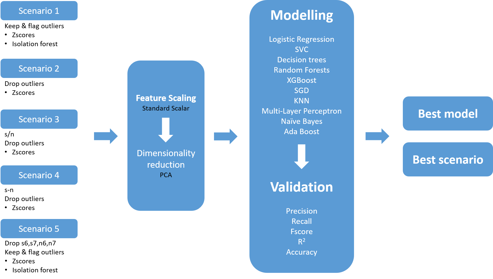

*Author: Sunil Veeravalli* 

This is a case study to accurately find out the assigned gate for an aeroplane from sensor readings that will make the airport more efficient and improve its billing application.

### CASE
The challenge problem involves an airport.  The airport has four gates and seven sensors placed around the airport.  The airport would like to know which gate the aircraft went to given the sensor readings.  Being able to accurately establish the assigned gate from sensor readings will make the airport more efficient and improve its billing application.  

The airport has provided 2,000 examples of a gate assignment along with the readings of seven sensors at each assignment.  The challenge is to build a model that will accurately predict the gate based on the sensor readings available. 

The following data files are available:
* master.csv – Data on the gate assignments for incoming flights
* assignment - The key of a gate assignment event provided by the airport
* gate - The gate assigned when the aircraft opened its doors
* stream[1-7].csv – Data from each sensor is provided in a separate file
* assignment - The key of a gate assignment event provided by the airport
* s[1-7] - A reading from the sensor at the event time
* n[1-7] - A reading from the sensor at the event time

### MY SOLUTION
Upon extracting the zipped folder you received, the file structure you see will be as follows:

* **Folder: 'Scripts'**
    * Contains jupyter notebook files. 
    * Start reading with file `01_Importing and Cleaning.ipynb` to `07_Final.ipynb` in the same order.
* **Folder: 'Raw_Data'**
    * Contains all instruction and data files sent by you
* **Folder: 'Clean_Data'**
    * Contains files and folders I created during the project, so that one need not run all scripts to create an object. Import the object from this 'Clean_Data' folder and start from there.
    * Folders: 'Scenario[1-5]'
        * Each folder contains data files in pickle and numpy format
    * Folder: 'Final'
        * Contains the final tables for the metrics: precision, recall and fscore generated from all models and all scenarios
* **Folder: 'Images'**
    * Contains images and snapshots used in creating this `Readme.md` file
* **Folder: '.git'**
    * Used a git version control system to track and manage file creations and changes.

## Study design
* I answered the question in five different scenarios and the work flow is as follows:  

* Script for each scenario is saved as an independent file in the folder **Scripts**

## Starting Jupyter notebook
* 'Jupyter notebook' package should be installed either using **pip** or **conda**
* On Windows computer after pip installation of jupyter notebook:
    * Open `cmd` prompt and change to path to your 'Cirium Project' directory
    * Type `jupyter notebook` and press enter
    
    

### File: '01_Importing and Cleaning.ipynb'
* Imported data from 'Raw_Data' folder into jupyter notebook and then performed EDA analysis

### File: '02_Scenario 1.ipynb'
* Rows with extreme outliers were dropped
* All other outliers were flagged using a combination of ZScores and Isolation forest methods
* Feature scaling, dimensionality reduction, modelling and validation

### File: '03_Scenario 2.ipynb'
* Rows with extreme outliers were dropped
* Rows with at least one outlier (based on ZScores) were dropped
* Feature scaling, dimensionality reduction, modelling and validation

### File: '04_Scenario 3.ipynb'
* s/n ratio for each sensor was calculated and dropped independent features: s1, n1, ..., n7
* Rows with extreme outliers were dropped
* Rows with at least one outlier (based on ZScores) were dropped
* Feature scaling, dimensionality reduction, modelling and validation

### File: '05_Scenario 4.ipynb'
* s minus n values are calculated and dropped independent features: s1, n1, ..., n7
* Rows with extreme outliers were dropped
* Rows with at least one outlier (based on ZScores) were dropped
* Feature scaling, dimensionality reduction, modelling and validation

### File: '06_Scenario 5.ipynb'
* Features 's6', 'n6', 's7' and 'n7' were dropped
* Rows with extreme outliers were dropped
* All other outliers were flagged using a combination of ZScores and Isolation forest methods
* Feature scaling, dimensionality reduction, modelling and validation

### File: '07_Final.ipynb'
* All the metrics (precision, recall, fscore) from each scenario saved as pickle file in their respective 'Clean_Data' folders were pulled and merged together
* Top five models based on their average score were populated and used as a basis to get to the following conclusion.

## Conclusion:
* The best model is `Logistic Regression`
* The best scenario is `Scenario 2`
* List of top five metrics across all models:

