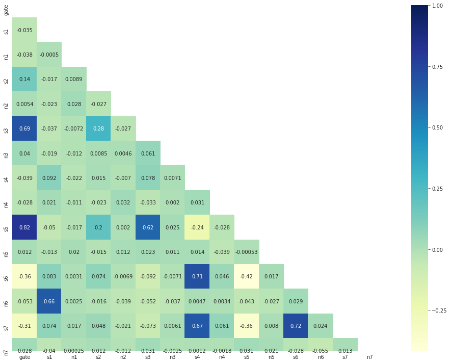

# Scenario 1
Rows with extreme outliers were dropped
All other outliers were flagged using a combination of ZScores and Isolation forest methods

# Scenario 2
Rows with Extreme outliers were dropped
Rows with at least one outlier (based on ZScores) were dropped

# Scenario 3
s/n ratio is calculated
Rows with at least one outlier (based on ZScores) were dropped

# Scenario 4
s-n ratio is calculated
Rows with at least one outlier (based on ZScores) were dropped

# Scenario 1
Features 's6', 'n6', 's7' and 'n7' were dropped
Rows with extreme outliers were dropped
All other outliers were flagged using a combination of ZScores and Isolation forest methods

# Followed by:
Feature scaling
Dimensionality reduction with PCA

s1 = signal 1
n1 = noise 1

